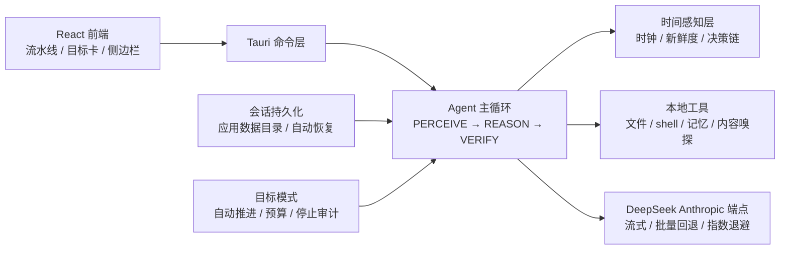

# DeepSeek Code · 小鲸鱼

一个专为 **DeepSeek 模型**设计的民间 IDE 界面，界面也是好看的**鲸鱼和深海色**！

**项目特色：**

1. 引入**时间戳 Harness**——给模型装上时钟，分清"昨天"和"现在"
2. 为**上下文缓存**做了特殊优化——长会话也便宜
3. **审美得到了一定的提升**——深海鲸鱼配色，告别呆板

> 欢迎腻歪了 Codex、Claude Code 界面审美的小朋友来测！

> **🤝 本项目由 DeepSeek V4 Flash 协助完成**——从时间感知层的设计、agent
> harness 的实现与调优，到基准验证与文档整理，全程有它深度参与。


## 为什么值得一看

大模型的 agent harness 有一个被忽视的缺陷：**模型没有时间感**。1M 上下文让
这条缺陷被放大——昨天的工具结果和两分钟前的并排躺着，模型把它们一视同仁。
DeepSeek Code 用一套可测评、可量化的方案回应了这个问题：

- **时间感知层（TAL）**：单一权威时钟 + 每个工具结果的 `[data_time=...]`
  新鲜度标注 + per-tool 保鲜期 + "自己算 age、标签可能错"的决策链提示词。
  它让模型学会：新鲜数据要信任、陈旧数据要重查、跨时区别被日期翻转骗了。
- **目标模式（Goal Mode）**：把当前命令提升为跨轮次目标，agent 连续工作到
  完成；暂停/继续、token 预算、轮次上限、ESC 打断、停止原因可见。
- **缓存经济学**：时间戳用"分桶年龄 + 尾端时钟"的布局，实测保留 ~99% 的
  DeepSeek 前缀缓存命中——时间感知不是免费的，但在这里近乎免费。

## ✨ 核心特性

### 🐋 时间感知层（Time Awareness Layer）

| 能力 | 说明 |
|---|---|
| 单一权威时钟 | 系统提示无时钟（避免双时钟冲突），每轮请求尾部注入 `now` |
| 新鲜度标注 | 工具结果打 `[data_time=... age=... horizon=...]`，per-tool 保鲜期 |
| 决策链提示词 | "自己算 age 对比 horizon、标签可能错"——把标签跟随变成年龄推理 |
| 内容级新鲜度 | `web_fetch` 嗅探页面自带时间戳（"21分钟前"、2017 年缓存参数） |
| per-model ETA 校准 | Flash 高估 3.71×、Pro 低估 0.56×——计划步骤 ETA 按模型校准 |
| 时区健壮性 | +0800 与美股 ET 跨日期翻转陷阱，带 TAL 实测 100%（基线 75%） |

### 🎯 目标模式（Goal Mode）

- **设定为目标**：输入框一键把当前命令提升为跨轮次目标，立刻开工
- **自动推进**：每轮结束自动续作，直到 完成 / 受阻 / 预算耗尽 / 上限 / ESC
- **完成审计**：模型必须验证过才允许标记完成——批量实测 3/3 目标自动完成，
  平均 4.7 轮，无一次空手完成
- 暂停/继续、token 预算、轮次上限、停止原因，全部可见可操作

### ⚡ DeepSeek 原生优化

- **1M 上下文，无压缩优先**：整仓索引，仅 >90% 时软遗忘（保留用户消息与推理链）
- **缓存命中实测 ~99%**：分桶年龄 + 尾端时钟，前缀缓存几乎无损
- **思考预算**：DeepSeek 对 thinking token 计费，Think/Deep 预算可调
- **Flash ⇄ Pro 热切换**：切换模型保留完整会话上下文
- **并行工具执行**（上限 4）+ 结果按声明顺序合并（协议安全）

### 🛠 工作流与体验

- **任务流水线**：思考链折叠为"任务 + 行动"卡片，结果消息完整渲染（GFM 表格
  支持），过程可督查、结果不丢失
- **会话持久化**：存应用数据目录，重启自动恢复最近会话，完整 tool 块保真
- **工具侧边栏**：终端 / 浏览器独立侧边栏，可拖拽调宽，顶栏图标开关
- **对话区宽度守卫**：面板全收起时聊天列固定居中，不再全屏走形
- 中英文 i18n、Diff 审查、项目记忆、web 搜索（服务端工具）

## 🏗 架构



```
src/                React 前端（ChatPanel / TaskPanel / Toolbar …）
src-tauri/src/
  agent.rs          Agent 主循环 + 目标模式自动推进 + 时间戳注入
  context.rs        上下文引擎 + TAL 规则
  tools.rs          本地工具执行 + 符号链接安全 + 内容级新鲜度嗅探
  api.rs            DeepSeek 兼容端点（重试退避 / 取消感知 / 流式回退）
  session.rs        会话持久化（含 goal + plan）
```

## 🚀 安装与运行

### 普通用户：下载安装包（推荐）

从 **[Releases](https://github.com/Apricotwine/deepseek-code/releases)** 下载最新
版 `DeepSeek Code.dmg`，打开后拖入 Applications 即可使用——**无需 Node / Rust /
终端**。首次启动在设置中填入 DeepSeek API Key。

### 开发者 / 贡献者：从源码构建

> `npm run tauri dev` 是**开发模式**（前端热更新 + Rust 调试编译），不是最终
> 用户的安装方式；普通用户请走上面的 Releases 安装包。

**前置依赖**：

- [Node.js](https://nodejs.org) ≥ 18（推荐 20+）
- [Rust](https://rustup.rs) stable（Tauri 2 要求）
- macOS：Xcode Command Line Tools（`xcode-select --install`）；
  Linux 需 Tauri 系统依赖（webkit2gtk 等）；Windows 需 WebView2 + MSVC

然后：

```bash
npm install
npm run tauri dev
```

> 首次 `tauri dev` 会编译 Rust 后端，耗时几分钟属正常。

打包安装包：

```bash
npm run tauri build   # 产出 src-tauri/target/release/bundle/dmg/*.dmg
```

API Key：在 [platform.deepseek.com](https://platform.deepseek.com) 获取，设置里
填入即可（端点固定为 `api.deepseek.com` 的 Anthropic 兼容协议，模型
`deepseek-v4-flash` / `deepseek-v4-pro`）。Key 仅存于本机系统设置文件。

**遇到问题？** 前端纯 Vite 可直接 `npm run dev` 浏览器预览 UI；
后端单测 `cargo test --manifest-path src-tauri/Cargo.toml`。

## 📊 验证与基准

以下为内部验证数据（benchmark 脚本与结果在仓库外维护）：

**时间感知（72 用例 × 双模型）**

| 探针 | Flash 基线 → TAL | Pro 基线 → TAL |
|---|---:|---:|
| T1 工具调用时机 | 62.5% → **91.7%** | 44.4% → **100%** |
| T1 标签翻转（对抗） | 26.4% | 30.6% |
| T1 决策链 + 翻转标签 | **98.6%** | **98.6%** |
| T3 时间一致性审计 | 93.1% → 95.8% | 93.1% → 95.8% |

**目标模式（真实工具执行）**

- 3/3 目标自动完成，平均 4.7 轮
- 每个目标标记完成前都执行过验证（运行代码/测试），无空手完成

**缓存命中**

- 无 TAL：96.5%–98.0% 缓存占比；有 TAL：**99.4%–99.5%**

**测试**：`cargo test` 19 个单测（时间戳注入、计划语义、停止条件、协议安全）。

## 🔒 安全

- API Key 仅存于系统设置文件，仓库无密钥
- 文件工具对工作区路径做符号链接规范化，防逃逸
- 会话 / 记忆 / 临时文件目录不入库

## ⚖️ License

MIT
