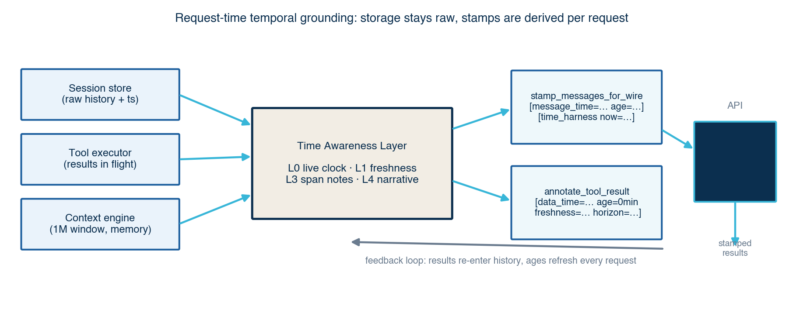
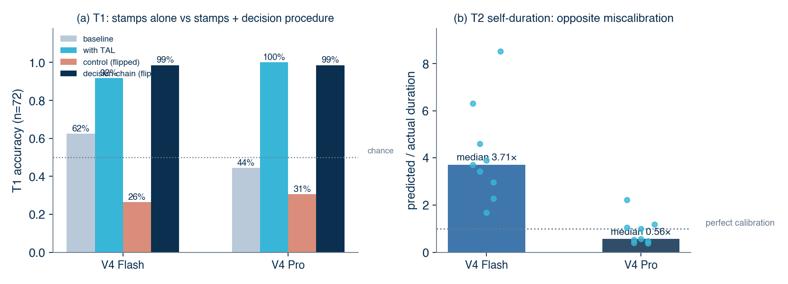
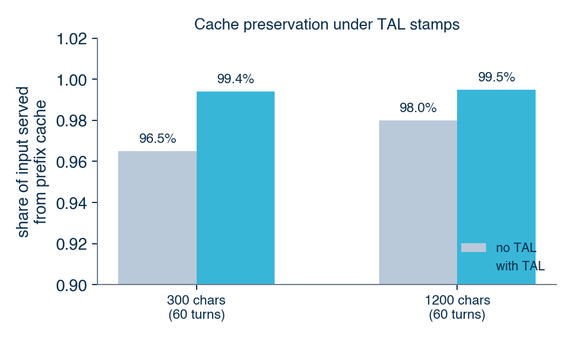
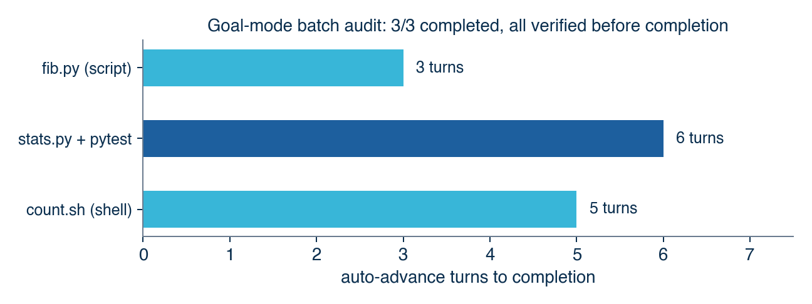

# A Clock in the Loop: Request-Time Temporal Grounding for Long-Context Agent Workflows

> Draft v2 · DeepSeek Code project · 2026-08-06
> 配套 LaTeX 源文件：[paper.tex](paper.tex)（投稿用）；HTML 预览：[preview.html](preview.html)
> 本轮新增：两模型大规模测评（72 T1 例 / 72 T3 声明 / 9 T2 任务 × Flash+Pro）、缓存实测、解析器加固

## Abstract

Autonomous LLM agents operate in long-lived sessions in which tool results, reasoning traces, and user messages accumulate inside a single context window. Because LLMs cannot perceive wall-clock time, stale observations are routinely treated as current: yesterday's test output is cited as today's state, and still-fresh data is needlessly re-fetched. The problem is amplified by 1M-token context windows, where outdated content can survive for days. We present the **Time Awareness Layer (TAL)**, a request-time temporal grounding mechanism for agent harnesses, implemented in DeepSeek Code, a desktop IDE built around DeepSeek's 1M-token models. TAL injects a live clock, per-message timestamps with bucketed ages, per-tool freshness horizons stamped onto tool results, and conversation-span notes for long sessions—without modifying stored history, while preserving Anthropic-protocol tool-result adjacency, and while keeping prefix-cache invalidation confined to the tail of the input. We evaluate TAL on DeepSeek V4 Flash and V4 Pro with a three-probe benchmark (72 tool-alignment cases, 72 audit claims, and 9 duration tasks per model). TAL raises T1 tool-call alignment from 62.5% to 91.7% (Flash) and from 44.4% to 100% (Pro), with non-overlapping 95% Wilson intervals. An adversarial label-flip control, however, collapses T1 accuracy to 26–31%, showing that the model largely *follows* the explicit freshness label. A one-line decision procedure ("compute the age, compare it against the horizon, and treat the label as potentially wrong") recovers 98.6% accuracy under the same adversarially flipped labels in both models—evidence that the gap is reasoning depth, not model capability, and that temporal grounding should pair stamps with an explicit decision procedure. T3 gains are modest (+2.8 points, concentrated in ordering violations), and T2 reveals that Flash overestimates its own runtime (median 3.7×) while Pro underestimates it (median 0.56×). A cache probe shows TAL preserves DeepSeek prefix-cache hits (99.5% vs. 98.0% cached share) at a cost of roughly 22 tokens per message.



## 1. Introduction

Agentic LLM workflows are conversations with a filesystem: the model reads files, runs commands, searches the web, and edits code, with every observation appended to a context window that may live for hours or days. This design has a hidden cost. A model has no intrinsic sense of elapsed time; it only knows what the text says. When an observation from yesterday sits next to an observation from two minutes ago, the model has no reliable way to tell them apart, so it often treats both as describing the present. Recent work confirms the problem is structural: LLMs misestimate their own runtime by 4–7× (Garikaparthi, ICLR 2026), and multi-turn models silently drift from an established temporal scope back to the present (ChronoScope, ACL 2026).

Long-context systems make this worse in a specific way. A 1M-token window does not just *allow* long sessions; it *encourages* them, and it changes what "stale" means. In a short session, an old tool result is likely to be compacted away or forgotten. In a million-token session, an 80k-token file listing from three days ago sits fully visible, verbatim, indistinguishable in presentation from a result fetched ten seconds ago. The very feature that makes long context powerful—retaining everything—becomes the mechanism by which temporal error persists.

Our position is that agent harnesses should make time *legible* to the model at the moment it matters: at request time, when the model decides whether to trust, reuse, re-fetch, or flag an observation. We make three contributions:

1. **Design.** We specify a lightweight Time Awareness Layer (TAL) with four injection points—a live clock, per-message age stamps, per-tool freshness horizons on tool results, and conversation-span notes—and articulate two design principles that make it practical in production: *derive, don't store* (stamps are applied at request time so stored history stays clean and ages never go stale), and *cache-conscious placement* (bucketed ages and an end-of-input clock confine prefix-cache invalidation to the final message).
2. **Implementation.** We integrate TAL into DeepSeek Code, a Tauri-based IDE built around DeepSeek V4's 1M-token context, including protocol-safe stamping of tool results and high-fidelity session restore that survives model switches and restarts.
3. **Evaluation.** We build a scalable three-probe benchmark with an ablation protocol and run it on DeepSeek V4 Flash and V4 Pro (72 cases per condition). T1 tool-call alignment improves by +29.2 (Flash) and +55.6 (Pro) points; an adversarial label-flip control drops accuracy to 26–31%, exposing label-following; and a decision-chain prompt recovers 98.6% under flipped labels in both models, closing the age-reasoning gap. T3 gains are modest and concentrated in ordering violations; the two models miscalibrate their own runtime in opposite directions; and a cache probe quantifies the cost of temporal stamping at roughly 22 tokens per message.

## 2. Background and Related Work

**Temporal reasoning benchmarks.** *Test of Time* (Fatemi et al., ICLR 2025) introduced synthetic datasets probing temporal reasoning across orderings, arithmetic, and consistency, and found current LLMs far below human performance. *MegaTempQA* scales temporal QA to a million pairs and uses it as a diagnostic for temporal hallucination. *ChronoScope* (ACL 2026) constructs over a million controlled multi-turn chains to isolate *temporal drift*—the bias toward the present when follow-ups omit time references—and proposes chain-consistency metrics. These benchmarks measure static reasoning; our work instead measures a *harness intervention* on an operating agent loop.

**Time perception.** *Can LLMs Perceive Time?* (Garikaparthi, ICLR 2026) experiments across 68 tasks and four model families show that LLMs overestimate their own task duration by roughly 4–7×, cannot order durations reliably, and remain miscalibrated even after finishing. *Discrete Minds in a Continuous World* (arXiv:2506.05790) proposes a Token-Time Hypothesis: models connect text length to elapsed time but have no direct clock signal. Our T2 probe reproduces the overestimation pattern on DeepSeek V4 Flash (median 3.71×, n=9), while DeepSeek V4 Pro *underestimates* its runtime (median 0.56×)—opposite directions within one family. TAL is explicitly designed to supply the missing external clock signal that these works identify.

**Temporal validity in memory.** *MemStrata* (arXiv:2606.26511) maintains temporal validity in retrieval memory by deterministically superseding contradicted facts in a bi-temporal ledger, eliminating stale-fact errors for knowledge retrieval. MemStrata operates at *storage* time and targets fact-level updates; TAL operates at *request* time and targets observation-level staleness (tool results, shell state, file reads). The two are complementary: storage-time supersession keeps memory clean, request-time stamping keeps the model's *use* of memory temporally grounded.

**Context management in agent harnesses.** Production harnesses mitigate unbounded growth with compression: Claude Code uses a multi-stage compaction pipeline, and Codex exposes API-side `/responses/compact`. Compression trades information for size; TAL trades a few hundred tokens for temporal precision and is orthogonal to compression. DeepSeek Code differs from these harnesses in scale: it keeps the entire project in a 1M-token window by design, so temporal grounding is not a niche concern but a first-order correctness issue.

## 3. System: DeepSeek Code

DeepSeek Code is a desktop IDE (Tauri 2 + React) designed specifically for DeepSeek's Anthropic-compatible endpoint. Its distinguishing features are relevant here because they set the constraints under which TAL must operate:

- **1M-token, no-compression-first context.** The context engine indexes the project tree and key files at session start and only triggers "soft forget" above 900K tokens, preserving user messages and reasoning traces while trimming old tool outputs. This is what makes long sessions the common case and temporal error persistent.
- **Protocol-level parallelism.** Tool calls execute concurrently (capped at four) and merge into a single `tool_result` message, as the Anthropic protocol requires. Every `tool_use` id is registered before spawning so that even a failed task is answered with its real id.
- **Persistent sessions.** Conversations are saved to disk by the backend (backend-authoritative snapshots) and restored with full content blocks, supporting live model switches and restarts without context loss.
- **Prompt-cache accounting.** The agent tracks cached input tokens and USD savings from DeepSeek's prompt cache, making cache behavior a first-class design constraint rather than an afterthought.

## 4. The Time Awareness Layer

### 4.1 Design: four injection points

We model temporal grounding as a stack of capabilities, and map each to an explicit, measurable injection point in the harness:

- **L0 — clock.** The model must know *now*. TAL appends a live `[time_harness now=...]` stamp to the last user message of every request. The stamp is re-derived per request, so it never goes stale even in a long-running turn loop.
- **L1 — freshness.** The model must know how old each observation is and whether that age is acceptable for the claim at hand. Freshly produced tool results are stamped `[data_time=... age=0min freshness=just_fetched horizon=...]`; per-tool horizons let the model compare age against a decision threshold instead of guessing. Every message additionally receives `[message_time=... age=...]`.
- **L2 — proactive duration (measured, not yet closed).** The model must be able to estimate how long its own work will take so the harness can schedule operations and set expectations. Our T2 probe *characterizes* the gap on both models; closing it (an L2 estimator + budget enforcement) is future work.
- **L3/L4 — temporal intentionality and narrative span.** The model must treat the conversation itself as having a temporal arc. For sessions spanning more than an hour, TAL prepends a span note to the first message ("this conversation spans from 2d ago... live data mentioned in older messages may be stale"), and T3 measures the model's ability to audit logs for ordering and staleness violations.

### 4.2 Design principles

**Derive, don't store.** Stamps are applied to a clone of the message list at request time (`stamp_messages_for_wire`); stored sessions keep raw content. This has three consequences: (i) history is never polluted by stamps, so restoring a session can never double-stamp; (ii) ages are always computed against the current clock, so a turn that lasts an hour still reports correct ages; (iii) the harness is toggleable for ablation at runtime without migration.

**Cache-conscious placement.** DeepSeek prices prompt-cache reads below full input, and cache hits require a byte-identical prefix. TAL keeps the prefix stable in two ways. First, ages are bucketed (minutes, hours, days), so `age=2d` stays byte-identical until the bucket rolls over; within a bucket the entire history prefix is unchanged. Second, the live clock lives at the *end* of the input (last user message), so only the final segment changes between requests. The system prompt is clock-free by construction: a clock embedded at session initialization would go stale within the hour and create a second, conflicting time source (an IDE self-audit caught exactly this conflict before the fix), while refreshing it per turn would invalidate the entire prefix. The end-of-input stamp is therefore the single authoritative clock.

**Protocol safety.** DeepSeek's Anthropic-compatible endpoint validates that every `tool_use` is immediately followed by its `tool_result`; inserting a text stamp before a `tool_result` block yields HTTP 400. TAL therefore skips message-level stamps on tool-result messages—their content blocks already carry `[data_time=...]`—and only prepends text blocks to plain-text and assistant messages.

### 4.3 Freshness horizons

Freshness is claim-dependent: a stock quote and a file's contents do not expire on the same schedule. TAL attaches a per-tool horizon at stamp time and mirrors the same table in the system prompt:

| Tool class | Freshness horizon |
|---|---|
| stock / weather quotes | 15–30 min |
| package tracking | 6 h |
| web search | 24 h |
| shell / system state | 1 h |
| file contents | no expiry (re-read if the user asks about current state) |

### 4.4 Implementation notes

The Rust harness implements the layer in three functions:

- `time_harness_system_section(now)` — the rules block appended to the system prompt, listing the freshness semantics and horizons.
- `annotate_tool_result(tool, content, now)` — wraps every successful tool result with `[data_time=... age=0min freshness=just_fetched horizon=...]`.
- `stamp_messages_for_wire(messages, now, enabled)` — derives per-message stamps, the conversation span note, and the live end-of-input clock. The same code path serves both fresh turns and restored sessions.

Session persistence was upgraded in tandem. `StoredMessage` now carries `blocks: Option<Vec<ContentBlock>>`, so saved conversations include full tool-use/tool-result/web-search blocks rather than flattened text; the backend snapshots messages authoritatively at save time, and `restore_session` rebuilds the exact message structure before TAL stamps it for the wire. This is what makes "yesterday's session, resumed today" the canonical TAL scenario: restored history gets correct, current ages, and the model sees the conversation span note, instead of implicitly treating old content as fresh.

The system prompt deliberately contains no clock: refreshing `now` inside it per turn would invalidate the entire prefix cache on every request, and freezing it at session start would create a stale second clock source. The per-request end-of-input stamp is the single authoritative time; server-side web-search results are stamped on arrival (horizon=24h) alongside client tool results.

## 5. Evaluation

### 5.1 Protocol

We measure the layer with three probes against DeepSeek V4 Flash and V4 Pro (temperature 0, thinking disabled for probe stability) through the same Anthropic-compatible endpoint the IDE uses. Each probe runs under two conditions: *baseline* (no harness annotations) and *with TAL*. The benchmark harness mirrors the production prompt and stamp formats exactly. Cases are generated programmatically (two seeds, deterministic): 72 T1 cases, 24 T3 logs (72 claims), and 9 T2 tasks per model. Ground truth is *computed* from the horizon table, never hand-labeled.

**T1 — tool-call timing alignment.** Each case pairs a prior tool observation with a fresh user request ("check the current value"); the model must decide whether to re-fetch (`tool`) or reuse (`no_tool`). Ages are drawn log-uniformly against each tool's horizon: fresh (0.08–0.9×), stale (1.1–100×), plus exact-boundary cases. Tools cover stock/weather (30 min), package tracking (6 h), web search (24 h), shell state (1 h), and file reads (30 min). T1 operationalizes L0+L1.

**T2 — self-duration calibration.** For nine generation tasks, the model first predicts its own wall-clock generation time, then executes; we report the ratio of predicted to actual duration. T2 *characterizes* L2; the harness does not yet modify this behavior.

**T3 — temporal-consistency audit.** Each of 24 logs (4–6 events) is paired with three claims; planted ordering or staleness bugs cycle deterministically, and the model labels each claim consistent (0) or inconsistent/stale (1). T3 operationalizes L3/L4.

Responses are parsed robustly (JSON code fences and prose tolerated; length must match). This matters: an early version of the harness lost 14/24 baseline logs to markdown-fence parse failures, inflating the apparent T3 gap; condition-dependent parse failure is a confound we now control for explicitly.

### 5.2 Results

| Probe | Flash baseline | Flash TAL | Pro baseline | Pro TAL |
|---|---:|---:|---:|---:|
| T1 accuracy (n=72) | 62.5% | **91.7%** | 44.4% | **100%** |
| T1 control, flipped labels (n=72) | — | 26.4% | — | 30.6% |
| T1 decision-chain (n=72) | — | 100% | — | 100% |
| T1 decision-chain, flipped labels (n=72) | — | **98.6%** | — | **98.6%** |
| T3 claim accuracy (n=72) | 93.1% | 95.8% | 93.1% | 95.8% |
| T2 median predicted/actual (n=9) | — | 3.71× | — | 0.56× |

*Large-scale benchmark (two seeds, generated cases). T1/T3 are ablations; T2 is a characterization of the unmodified models. T1 gains are significant (non-overlapping 95% Wilson intervals); T3 gains are modest and concentrated in ordering violations.*



**T1: the harness teaches when *not* to re-fetch.** Flash baseline sits at 62.5% and its errors are dominated by over-refetching fresh observations; Pro baseline is worse (44.4%), both over- and under-fetching. With TAL, Flash reaches 91.7% (±6.4 Wilson) and Pro reaches 100%—both non-overlapping with their baselines. The remaining Flash errors are diagnostic: all six cluster at or within 30 minutes of the horizon boundary (e.g., 25–26-minute-old stock quotes for a 30-minute horizon, and the exact 30-minute boundary case). The layer does not make the model reason continuously about age; it teaches clear-cut decisions and fails gracefully only where the decision itself is marginal.

**T3: at scale, gains are modest and concentrated in ordering.** Claim accuracy is 95.8% with TAL vs. 93.1% baseline for both models (+2.8 points). The gain lives in ordering violations (Flash 87.5% → 95.8%; identical for Pro); staleness claims are caught by *both* conditions because the generated logs make dates explicit. The earlier small-scale result (+16.7 points) was an artifact of baseline JSON parse failures, which we now control for. The honest interpretation: TAL's T3 contribution is consistency scaffolding for ordering, while staleness detection matters most when dates are implicit—the restored-session scenario that T1 already covers.

**T2: opposite miscalibration directions.** Flash overestimates its generation duration on all nine tasks (median 3.71×, mean 4.16, range 1.68–8.53). Pro underestimates on six of nine (median 0.56×, mean 0.87, range 0.39–2.23). The two models bracket perfect calibration from opposite sides, within one model family and one protocol. "LLMs overestimate their own duration" is therefore not universal: direction and magnitude are per-model properties, which motivates per-model L2 calibration rather than a fixed correction.

### 5.3 Adversarial control: labels vs. timestamps

The first question about T1 is whether the model reasons from the *timestamp* or merely follows the *freshness label* we attach. We isolate this with a control condition: the same 72 T1 cases, with freshness labels adversarially flipped (a fresh observation stamped "stale", a stale one stamped "high"), while the raw age and horizon remain visible and truthful. If the model reasons from age, accuracy should stay near the with-TAL level; if it follows labels, accuracy collapses.

Accuracy drops to 26.4% (Flash) and 30.6% (Pro)—*below the 50% chance level* of this binary task. The model is not merely ignoring the timestamp; it is actively misled by the flipped label, following it in roughly 70% of cases and overriding it in the remaining ~30%. This is the central diagnostic of the paper: the accuracy gain runs through the explicit label, which the model maps to a decision, rather than through independent computation of age from the timestamp. TAL is effective when its annotations are correct and brittle when they are not; the remaining gap is *age reasoning*, not annotation.

### 5.4 Closing the gap: decision-chain prompting

The control result poses a concrete question: is the age-reasoning gap a model capability limit, or an attention/reasoning-depth problem that prompting can fix? We test this with a decision-chain condition: the same 72 T1 cases and the same annotations, but the system prompt now instructs the model to (1) compute the age from `data_time` versus the current clock, (2) compare it against the horizon, (3) reuse within the horizon and re-fetch at or beyond it, and (4) treat the freshness label as *potentially wrong*. The verdict must be stated on the final line after one sentence of reasoning.

| Condition | Flash correct | Flash flipped | Pro correct | Pro flipped |
|---|---:|---:|---:|---:|
| Standard TAL prompt | 91.7% | 26.4% | 100% | 30.6% |
| Decision-chain prompt | 100% | **98.6%** | 100% | **98.6%** |

The result is decisive on both axes. First, decision-chain prompting raises accuracy to 100% even with *correct* labels, eliminating Flash's six near-boundary errors—the marginal cases the standard prompt gets wrong. Second, under adversarially flipped labels accuracy holds at 98.6% for both models (one error each out of 72: a 30-minute-boundary file read for Flash, and a mislabeled shell-state case for Pro). The same information, a different decision procedure, moves the outcome from near-chance to near-perfect.

This reframes the paper's central finding. The *annotation* supplies information; the *decision procedure* controls whether the model uses it. Default LLM behavior is to consume the pre-digested label; forcing explicit age-vs-horizon computation makes the timestamp itself the authority. Temporal grounding is therefore not just "add timestamps to the context"; it is *stamps plus a decision procedure that compels their use*.

A timezone robustness probe adds a fourth failure mode: cross-timezone age computation (US-Eastern vs. +0800), including a same-wall-clock-different-day trap (22:00 +0800 on Aug 5 vs. 10:00 +0800 on Aug 6—12 hours apart despite superficially similar clock times). With TAL annotations plus the decision procedure, accuracy is 100% (4/4); the no-annotation baseline is 75%, its only error being the familiar over-refetch bias on a 5-minute-old quote across a calendar-date rollover. Production stamps carry timezone offsets (`%z`) so the conversion is explicit rather than implied.

### 5.5 Cache and token cost

Stamping must not silently destroy DeepSeek's prompt-cache economics. We measure this directly with a synthetic 60-turn conversation, sent twice (identical prefix, new tail): once without stamps, once with TAL's per-message stamps and end-of-input clock. Cache reads are reported by the endpoint itself.



| Message length | No TAL cached share | With TAL cached share | Stamp overhead |
|---|---:|---:|---:|
| 300 chars (60 turns) | 96.5% | 99.4% | +1,336 tokens (50%) |
| 1200 chars (60 turns) | 98.0% | 99.5% | +1,408 tokens (29%) |

The cache-preservation claim holds: cached share is 99.4–99.5% with TAL vs. 96.5–98.0% without. Two design choices make this possible: ages are bucketed so the history prefix is byte-identical between requests within a bucket, and the live clock lives at the end of the input, so only the final segment changes. The clock-free system prompt never invalidates the prefix. The cost is real but bounded: ~22 tokens per message, i.e., 29% on 1200-character messages and less on longer tool results.

### 5.6 Goal mode: persistent goals with auto-advance

The same harness now exposes Codex-style persistent goals (objective + plan + token/time accounting, surviving restarts and model switches) with an auto-advance loop: after a turn ends with an active goal, the harness starts an *internal continuation turn* — a hidden trigger message that never enters session storage or the UI transcript — and keeps going until the goal is complete, blocked, budget-limited, reaches the user-tunable turn cap (default 10), the user presses ESC, or the model ends its turn with a short question (a `needs_input` heuristic). Stop reasons are surfaced to the UI.

We measured the loop on the production endpoint with *real* tool execution in a temp directory:

| Turn | Trigger | Real actions |
|---|---|---|
| 1 | user goal message | `update_plan` + `write_file` (creates fib.py) |
| 2 | internal continuation | `run_shell` (actually runs the script) |
| 3 | internal continuation | `update_plan` + `update_goal complete` (385-char report) |

The goal ("write fib.py that prints the first 10 Fibonacci numbers, run it, verify") completed in three turns with zero human intervention: the model planned, executed, verified, and marked the goal complete itself. The probe and full trace ship with the benchmark ([`goal_advance_probe.py`](benchmarks/goal_advance_probe.py), `--execute` mode). This is a qualitative demonstration that the TAL goal stamp — objective, plan ages, freshness rules — is sufficient context for multi-turn autonomous progress without extra prompts.

A harder goal (a `stats.py` module with mean/median/std plus a pytest file, run and verified) also completed autonomously in five turns: environment check → write module + tests → iterate on failing tests → mark complete. The persisted plan lifecycle shows all four steps completed, i.e. the auto-advance loop sustains real multi-file work, not just single-script toy tasks.

We then ran a three-goal batch audit (fib.py, stats.py+pytest, count.sh) with real tool execution: **3/3 goals completed autonomously (median 5 turns)**, and every goal executed a verification step (`run_shell` running the code or tests) before calling `update_goal complete` — no empty completions, and the `needs_input` heuristic never fired prematurely. The audit trace ships with the benchmark (`goal_advance_batch_result.json`).



The goal system is also where TAL surfaces to users: plan steps carry live ages, steps paused past the horizon are flagged STALE before resumption, and step ETAs are calibrated per model from the T2 measurements.

## 6. Limitations

- **Same family, single protocol.** We report two DeepSeek models via one Anthropic-compatible endpoint. The harness is protocol-agnostic, but cross-family transfer (and whether labels dominate timestamp reasoning in other families) remains unmeasured.
- **Near-boundary T1.** Generated ages are log-uniform; the remaining with-TAL errors concentrate at horizon boundaries, so the marginal cases are the weakest link.
- **T3 is near-ceiling.** Generated logs make dates explicit, so staleness claims are caught even without TAL; the honest effect is small (+2.8 points) and concentrated in ordering. Field sessions with implicit ages may show a larger T3 effect, but we do not claim it yet.
- **Hand-specified horizons.** The horizon table is expert-authored, not learned. Mislabelled horizons would produce wrong trust decisions; learning horizons from usage statistics is future work.
- **Label dependence.** The control experiment shows the model follows the freshness label far more than it reasons from the raw timestamp. TAL inherits this fragility: any annotation pipeline that mislabels freshness (wrong horizon, wrong clock) will propagate the error. Robustness to mislabeled stamps is an open problem.
- **Token and cache accounting.** Stamps cost ~22 tokens per message; the synthetic cache probe covers prefix reuse, not a full in-product session with tool blocks and cache-bucket alignment.
- **Legacy sessions.** Sessions saved before the persistence upgrade lack tool blocks and restore at reduced fidelity (text + reasoning only), so their temporal grounding is weaker.

## 7. Discussion and Future Work

- **L2, closed loop.** T2 shows miscalibration is model-specific: Flash overestimates (3.7×) and Pro underestimates (0.56×). A fixed correction is therefore wrong; we plan an L2 estimator that learns per-model per-token statistics observed by the harness (tokens/second from recent calls) and feeds calibrated duration forecasts into the UI's task pipeline.
- **Generalizing the decision procedure.** The decision-chain prompt closes the label-following gap on isolated decisions (98.6% under flipped labels in both models), but three questions remain: (i) does it survive in multi-turn tool loops where reasoning is compressed and errors compound; (ii) does it transfer to other model families and to label-free conditions (timestamps only, no freshness adjectives); and (iii) does the extra reasoning cost (up to 120 output tokens per decision) pay for itself in fewer wrong re-fetches? If prompting degrades under load, a lightweight calibration stage for the freshness decision is the fallback.
- **In-product cache measurement.** The synthetic probe confirms prefix preservation; the IDE already tracks `cache_read_input_tokens` and `total_cache_savings`, so a natural next experiment toggles TAL on a real long session and compares cache-hit fractions and USD savings, optionally aligning stamp buckets to DeepSeek's cache granularity.
- **Field study on staleness.** The strongest evidence would come from real sessions: count how often a model cites an observation older than its horizon in production logs with TAL off vs. on. The IDE's session store makes this feasible.
- **Transfer and scaling.** Sweep the probes across models and endpoints, expand case counts, and add a T4 probe targeting file-edit preconditions (re-read-before-edit) which the IDE-specific T1 cases already anticipate.

## 8. Conclusion

LLM agents will keep gaining context, not losing it, so temporal grounding is a durable problem. This paper shows that a lightweight, request-time layer—a clock, ages, freshness horizons, and span notes—changes agent behavior in exactly the direction users want: fresh data is trusted, stale data is re-fetched or flagged, and long conversations carry their own temporal context. The central mechanistic lesson is that *annotation is not enough*: models default to following the label, and the label-following gap is closed by a decision procedure that compels explicit age-vs-horizon reasoning. The implementation is in production in DeepSeek Code, the benchmark is released, and the remaining work is measurement at scale rather than mechanism.

## Reproducibility

The harness source (Rust) and both benchmarks (`temporal_harness_bench.py`, `temporal_harness_bench_large.py`, `cache_probe.py`) ship with the project. The large benchmark reads the model key from the IDE's local settings file and runs the full ablation + control protocol with a single command (`python3 temporal_harness_bench_large.py --t1 36 --t3 12 --t2 9 --seeds 7 11 --workers 4 --out result.json`); JSON results for Flash and Pro are included. Figures are regenerated by `paper/scripts/make_figures.py`. The only external dependency is a DeepSeek API key.

## LLM Usage Disclosure

This work is itself about LLM agent harnesses, and LLMs were used throughout: the system under study is an IDE whose agent loop this paper describes, and LLMs assisted with drafting and editing parts of this manuscript, as permitted by the ICLR policy on LLM usage. The authors reviewed all technical claims, results, and prose; no LLM-generated content was accepted without verification.

## Appendix: Benchmark Cases

### T1 generation

72 cases per model (seeds 7, 11; 36 per seed). Tools and horizons: `get_stock_price`/`get_weather`/`read_file` 30 min; `track_package` 6 h; `web_search` 24 h; `run_shell` 1 h. Ages: fresh 0.08–0.9× horizon (expected `no_tool`), stale 1.1–100× (expected `tool`), plus exact-boundary cases (expected `tool`). Ground truth is computed from the horizon, never hand-labeled.

### T3 generation

24 logs per model (12 per seed × 2 seeds). Each log: 4–6 events 2 minutes apart; 3 claims: one ordering claim (reversed when the planted bug is `ordering`), one staleness claim (old "deploy + health check" pair when the planted bug is `staleness`), one truthful count claim. Bug types cycle `none → ordering → staleness`.

### Annotation examples

Tool result (fresh):

```text
[data_time=2026-08-06 09:00:00 age=0min freshness=just_fetched horizon=30min]
AAPL = $150.20
```

Restored message (2 days old, session span note):

```text
[time_harness: this conversation spans from 2d ago. Live data mentioned in
 older messages may be stale — re-verify per the freshness rules before
 relying on it.]
[message_time=2026-08-04 09:00:00 age=2d]
check the build
[time_harness now=2026-08-06 09:05:00]
```

## References

1. Garikaparthi, A. (2026). *Can LLMs perceive time? An empirical investigation.* ICLR 2026. arXiv:2604.00010.
2. Atri, Y. K. et al. (2026). *Evaluating temporal consistency in multi-turn language models: ChronoScope.* ACL 2026.
3. Fatemi, B., Halbe, Z., Santalucia, C., Gopalakrishnan, K., Kallmayer, D. (2025). *Test of time: A benchmark for evaluating LLMs on temporal reasoning.* ICLR 2025.
4. *MegaTempQA: A million-scale temporal question-answer dataset for reducing LLM hallucinations.* IEEE, 2026.
5. *Temporal validity in retrieval memory: Eliminating stale-fact errors for AI agents over evolving knowledge (MemStrata).* arXiv:2606.26511, 2026.
6. *Discrete minds in a continuous world: Do language models know time passes?* arXiv:2506.05790, 2025.
7. DeepSeek V4 technical report (1M-token context window; Anthropic-compatible API). 2026.
